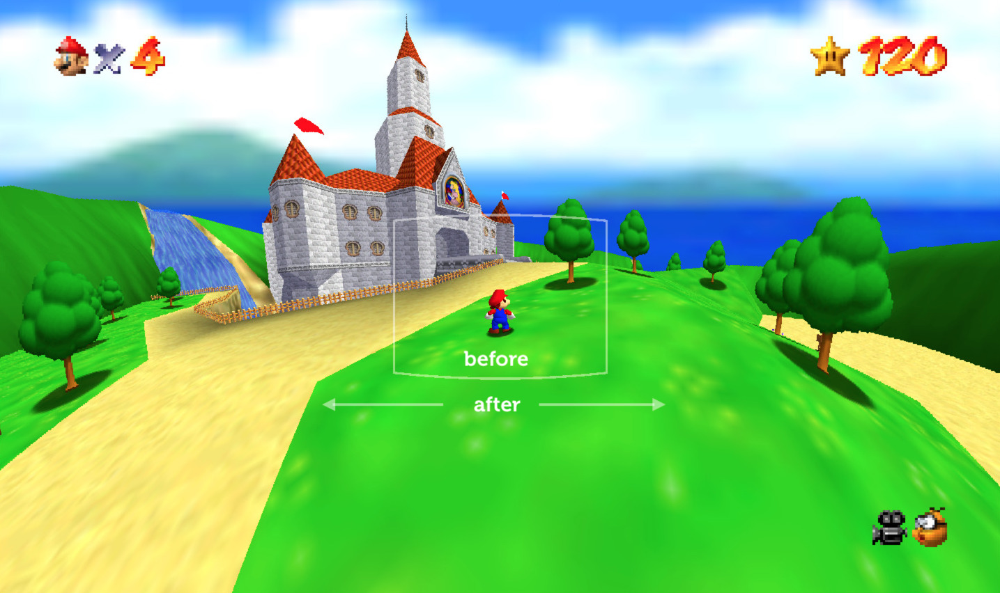

# flexfov for sm64

Play with 180° peripheral vision, as seen in [quake] and [minecraft].

🎥 See [demo video](https://youtu.be/EX-GF2JhLaI).

<table>
<tr>
<td>1. Render six 90° views</td>
<td>2. Stitch together by projection</td>
</tr>
<tr>
<td></td>
<td></td>
</tr>
</table>

outstanding issues:
- fog is non-uniform across cubefaces
- camera shake and roll misaligns cubefaces
- window in portrait mode clips cubefaces
- credit sequence misaligns cubefaces

[quake]:https://github.com/shaunlebron/blinky
[minecraft]:https://github.com/shaunlebron/flex-fov
