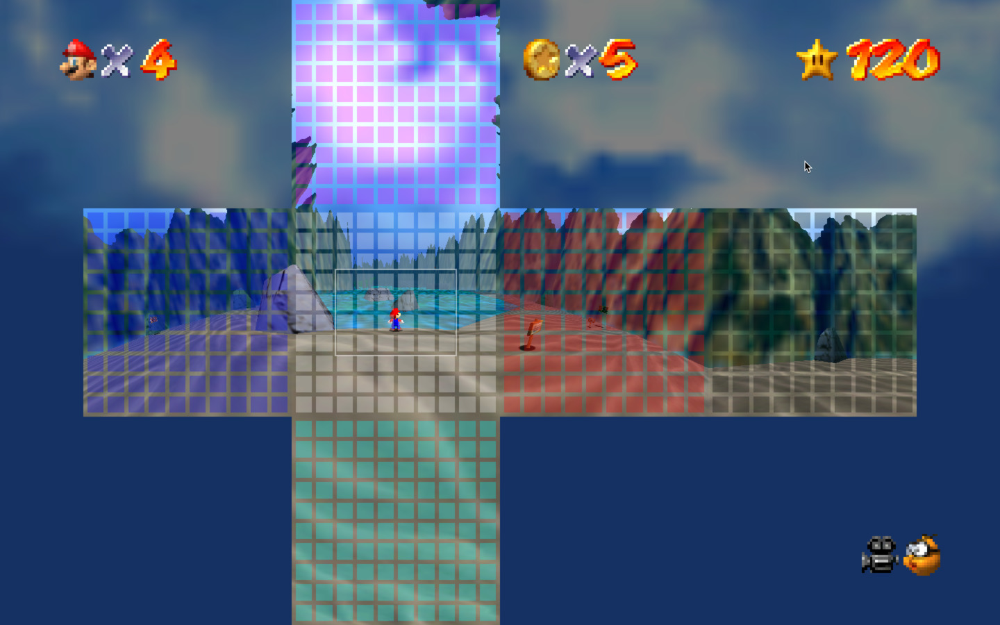
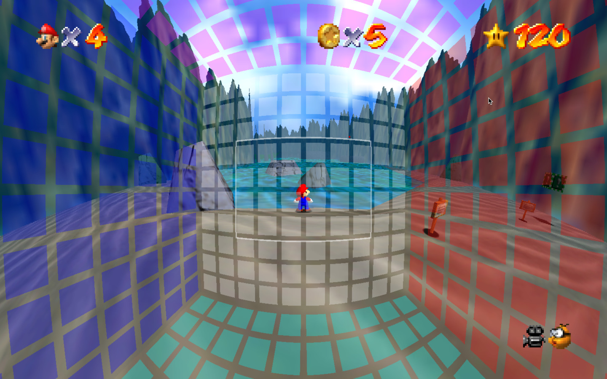

# flexfov for sm64

Extra camera controls for panoramic play.

🎥 See [demo video](https://youtu.be/EX-GF2JhLaI).

## Controls

Hold R to use extra controls:

* Thumbstick: change FOV (up to 360°)
* A: overlay grid
* B: box projection
* Z + thumbstick: zoom center of the image when fov > 180°

## How it works

<table>
<tr>
<td>1. Render six 90° views</td>
<td>2. Stitch together by projection</td>
</tr>
<tr>
<td></td>
<td></td>
</tr>
</table>

## Outstanding Issues

- fog is non-uniform across cubefaces
- window in portrait mode clips cubefaces

## References

As seen in [quake] and [minecraft].

[quake]:https://github.com/shaunlebron/blinky
[minecraft]:https://github.com/shaunlebron/flex-fov
