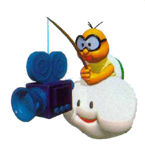

# Flex FOV for Super Mario 64

Hyper wide FOV controls for Super Mario 64.

* 🎥 See [demo video](https://youtu.be/EX-GF2JhLaI).
* 🎥 See [knob demo](https://imgur.com/a/yuxfbP7)

## Controls

Hold R to use extra controls:

* Thumbstick: change FOV (up to 360°)
* A: overlay grid
* B: box projection
* Z + thumbstick: zoom center of the image when fov > 180°

## How it works

<table>
<tr>
<td>1. Render six 90° views</td>
<td>2. Stitch together by projection</td>
</tr>
<tr>
<td></td>
<td></td>
</tr>
</table>

## Build

_**NOTE**: Only tested on x86 macbook, not yet building for m1 macbook_

* `./patch.sh` applies `patch.diff` engine changes to the `sm64-port/`
* `make all` copies the `flexfov.*` files to `sm64-port/`
* `./run.sh` runs `make all` then starts the game

## Fixing visual artifacts

It is simple in principle to render Super Mario 64 with an alternate projection,
but there are many visual artifacts that had to be fixed:

1. **Sky**: The cubemap is rendered without the sky.  The sky billboard is drawn first, then the projected cubemap is drawn over it.
2. **Fog**: Fog is changed to scale based on distance from camera, not distance from projection plane.
3. **Lighting**: Since lighting is always relative to the camera orientation in sm64, each cubeface submits to the lighting of the “front” cubeface.
4. **Shake**: (removed)
5. **Roll**: (removed)
6. **Billboards**: draw tree billboards as “cylboards”, and every other billboard as “sphereboards” (see next section)

## Theory: drawing billboards on cubemap

A **Billboard** is usually drawn parallel to the projection plane and is
rotated to share the camera’s “up” direction.

However, we cannot do this when rendering a billboard to a **cubemap**, since
we need a consistent orientation across all six projection planes.  The normal
method will cause it to “crease” when appearing across the edges of a cubemap.

The key is to make the billboard position and orientation a function of the
*camera position only*.  In other words, when rendering to a cubemap (or *any*
environment map), a billboard should be unaffected by the camera’s pitch, yaw,
and roll.

### Solution #1: “Sphereboard”

A “sphereboard” is a billboard oriented along a special kind of sphere:

* the **center** of the sphere is at the camera’s location
* the **radius** of the sphere is the distance from the camera to the billboard
* the **north pole** of the sphere is locked to the world’s “up” direction (opposite to gravity)

The billboard is then oriented by two vectors:

* **“normal” direction** is locked to the center of the sphere
* **“up” direction** is locked to the north meridians of the sphere (like a compass)

### Solution #2: “Cylboards”

_Background: This is the solution we use for the tree billboards in Super Mario
64, and nothing else.  “Cylboard” was coined by the [sm64ex] team.  When I asked
them on Discord, they said they added it to make the trees look better with a mouse-look camera. I believe the
original sm64 trees were designed to scale up when the camera was viewing them
from above or below to make the leaves hide the incorrectly oriented trunk._

Cylboards are billboards that only rotate horizontally to face the camera— as
locked inside an invisible cylinder.

[sm64ex]:https://github.com/sm64pc/sm64ex

## Projection Method

_**TLDR**: My apologies for the cryptic descriptions below, they are concise
notes to myself that I will try to unpack later.  The basic idea is that we
transition between Panini and Stereographic projection based on camera’s pitch
angle, then we create a smooth transition to Mercator for larger FOVs using a
mobius projection._

We choose the best default projection based on your desired FOV, and let you
scale the center region if you want.  We do this as fluidly as possible using
the following knobs, projections, and procedures.

### Knobs

- fov (manual)
- pitch (auto)
- mobius (auto or manual)

FOV and mobius are coupled when automatic:

```
                       180°            360°
      fov <-------------|--------------->
                        |--------------->   mobius
               0.5     0.5            1.0
```

### Projections

- panini (architecture)
- stereographic (ground/sky)
- mercator (world)

```
             0°     pitch     ±90°
      panini <------------------> stereographic
                      ^
                      |
                      | mobius
                      |
                      v
                   mercator
```

### Procedures

Key:

```
    _
   (_)  >  ---     Forward projection (sphere to plane)
            _
   ---  >  (_)     Inverse projection (plane to sphere)

   ---  >  ---     Scale (plane to plane)
```

Overview:

```
    _                       _
   (_)  >  ---  >  ---  >  (_)  > --- > ---       <--- topologies
    1       2       3       4      5     6

          pitch   mobius                fov       <--- relevant knobs
         ---------------         -----------
             panini/               mercator       <--- projections
          stereographic
```

1. Sphere of pixels collected from cubemap.
2. Forward projection to plane, using pitch-based panini-stereographic.
3. Scale using the mobius factor.
4. Inverse projection to sphere, using original panini-stereographic (non-scaled).
5. Forward projection to plane using mercator.
6. Scale such that the desired fov range touches screen bounds.

### Why Mobius?

A “Mobius” factor is used to push the pixels on the sphere *toward* or *away*
from the center of the screen.  The scaling is done on a projected plane, then
projected back to the sphere.  The spherical image is now warped by the
projection.  Why?  Two reasons:

1. Feathering the transition to mercator after 180°. It looks more natural—than
   ray interpolation—to  “bake in” the panini/stereographic projection into the
   image that mercator is projecting.
2. Allowing custom magnification when approaching 360°.

References:

- *Spherical video editing with Möbius transformations*: [video](https://youtu.be/oVwmF_vrZh0), [blog](https://web.archive.org/web/20190627155016/http://elevr.com/spherical-video-editing-effects-with-mobius-transformations/)
- *The Mercator Redemption*: [paper](http://archive.bridgesmathart.org/2013/bridges2013-217.pdf)

_Thanks to Jai for finding and sharing this transformation method. And thanks
to Richard for asking if cropping a panini-zoomed mercator would be similar to
panini alone, leading to our use of it to feather the transition._


## Outstanding Issues

- window in portrait mode clips cubefaces
- mirror wall is lit inconsistenty across cubefaces
- particles (snow, bubbles) are only rendered on front cube face
- health meter flickers (bad depth test from extending near clipping plane?)

## See Also

This project shares a lineage with the following projects:

1. [Blinky for quake][quake]
2. [Flex FOV for minecraft][minecraft].  Latest code [here](https://github.com/18107/Flex-FOV-fabric)

[quake]:https://github.com/shaunlebron/blinky
[minecraft]:https://github.com/shaunlebron/flex-fov
